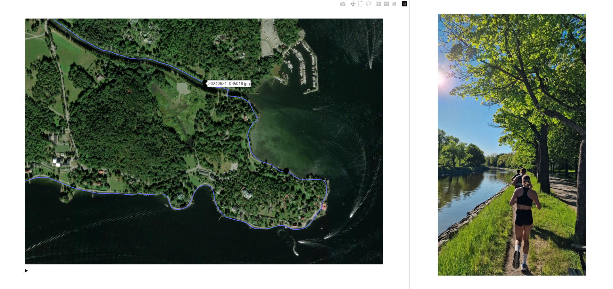

# StoryTrack
:sunrise_over_mountains: An application to visualise your hiking/running/cycling routes with geotagged photos.

## Features / To-Do
- [x] Process GPX files
- [x] Visualise route on a map
- [x] Clickable markers on map for displaying photos 
- [ ] Upload photos/gpx files via phone
- [ ] Fetch and map photos automatically
- [ ] Performance/convenience improvements (compose, config etc.)
- [ ] Elevation profile etc.
- [ ] Animated playback

## Setup
- Download gpx files from for example your Garmin Connect account and place them in `root/gpx_files`
- Place images in `assets/photos`
- Specify file to view in `app.py`
- Build the images:
    - Base image: `docker build -f base.Dockerfile -t storytrack-base:latest .` (this might take a few minutes).
    - Processing image: `docker build -f process.Dockerfile -t storytrack-process .`
    - App image: `docker build -f app.Dockerfile -t storytrack-app .`
- Run processing: `docker run --rm --name process -v "$(pwd)/gpx_files":/app/gpx_files -v "$(pwd)/output":/app/tmp storytrack-process`
- Run app: `docker run --rm --name app -p 8050:8050 -v "$(pwd)/output":/app/tmp storytrack-app`
- Open your browser and go to `localhost:8050` to see the app running.

Optionally, you can run the app without Docker, then install requirements and run `data_processing.py` and `app.py`. 
*Local installation only tested on WSL2*